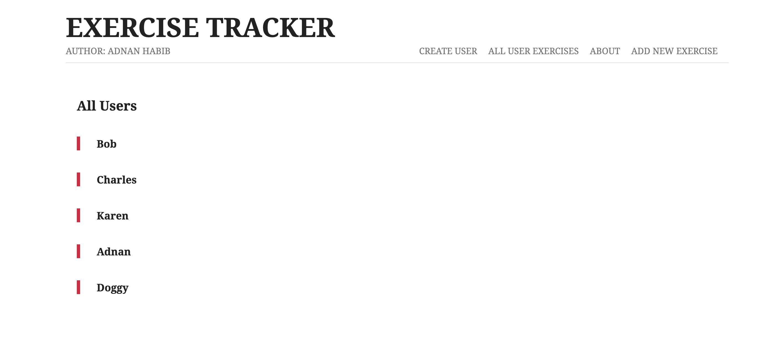
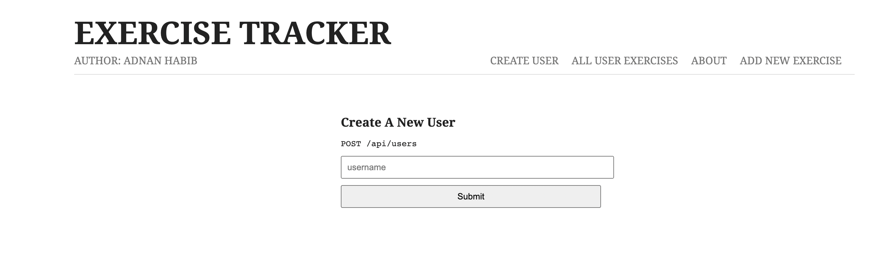
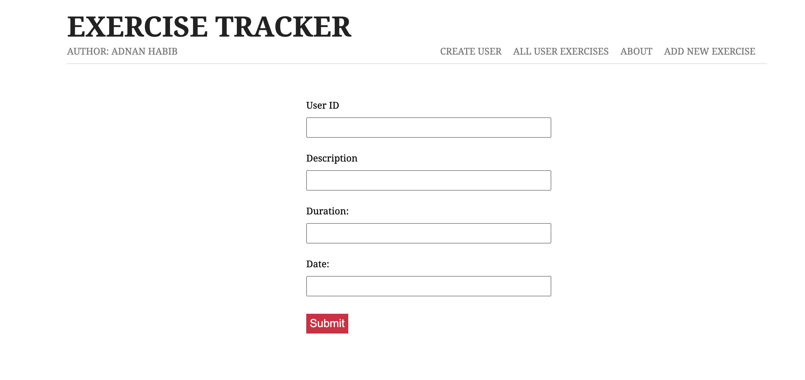
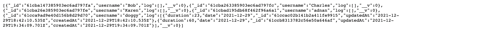

# Exercise Tracker 

A Full-Stack Javascript Application 

This is an application that allows one to create users, and gives them the ability to add exercises which includes the description, duration and date of the exercise that gets saved to a database. One can acess each indiviual user's exercise log using their specifc user id, or access the exercise logs of all users. The technologies used for creating this app include node.js for the backend, mongodb / mongoose for handling the database and ejs / vanilla javascript / css for the front end. 

## Demo ## 

